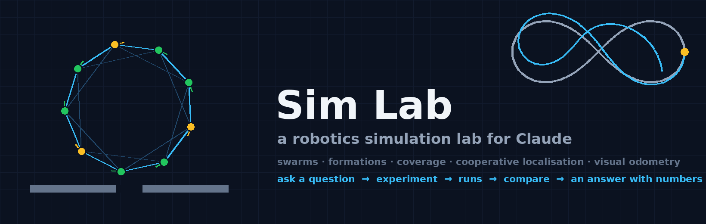
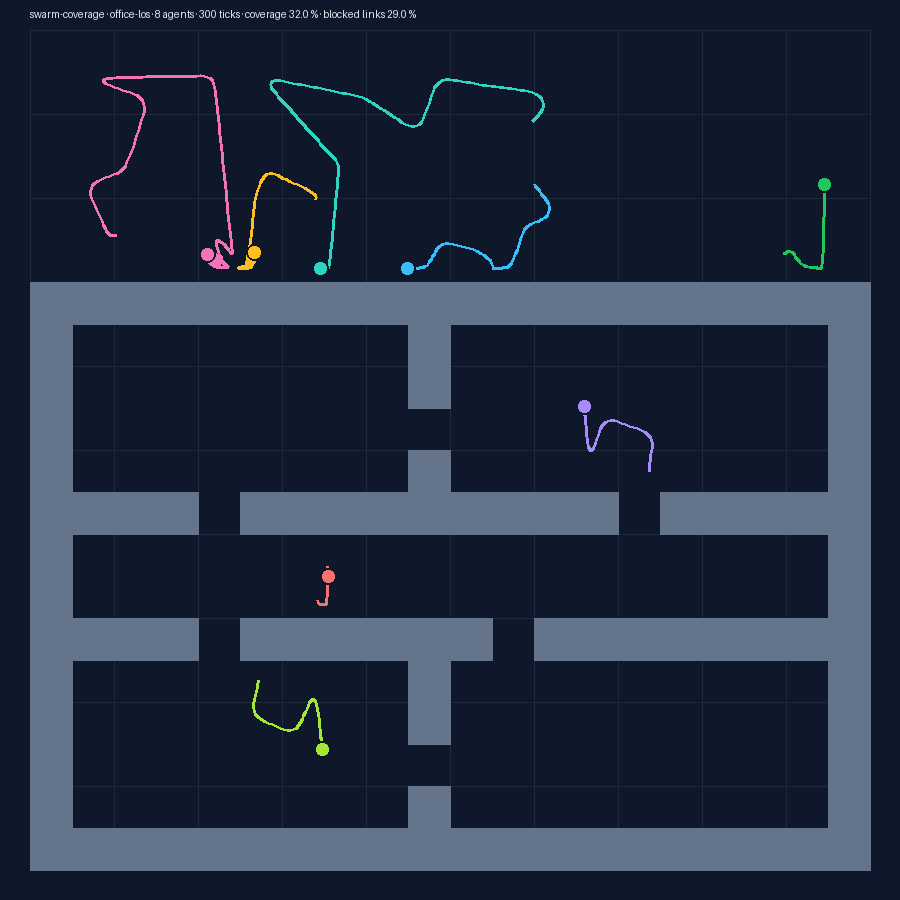
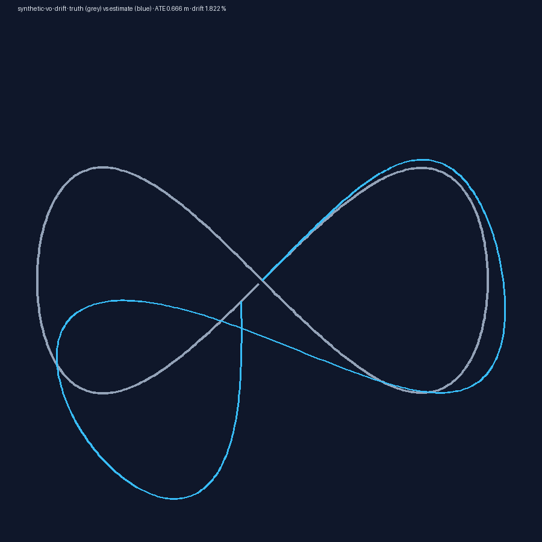

<p align="center"></p>

# Sim Lab

[](https://github.com/najikay/claude-simlab/actions/workflows/tests.yml)  

**A robotics simulation lab for Claude.** Ask a question about a swarm, a formation, coverage, cooperative localisation or visual odometry, and Claude designs the experiment, runs it on your machine, compares the runs and answers with numbers you can reproduce.

> "Does a formation of 12 drones still close when the radio drops 60 % of messages?"
> → one campaign, four runs, a compare table, an answer in metres, and a findings note with the run ids.

Everything runs locally. No account, no network, no telemetry. Python 3.10+, `numpy` and `pyyaml`.

<p align="center">


</p>
<p align="center"><sub>Left: <code>swarm-coverage</code> on the <code>plan:office</code> layout with walls blocking radio links. Right: <code>synthetic-vo</code> under heading drift, truth (grey) vs estimate (blue). Both drawn from real runs.</sub></p>

## What is in the box

| Piece | What it does |
|---|---|
| **`sim-lab` MCP server** | 12 tools: catalogue, experiments, run, campaign, tune, runs, compare, floor plans. Stdio, stdlib JSON-RPC, no framework. |
| **`simlab-run` skill** | How Claude turns a question into a one-knob sweep, estimates cost, runs, compares, checks the seed and answers. |
| **`simlab-findings` skill** | A one-page reproducible findings note: question, setup, table, reading, limits, reproduce. |
| **Swarm world** | N agents in a 2-D arena with range-limited lossy, delayed radio; behaviours flock, formation, rendezvous, coverage, goto; belief filters (exponential, Kalman, unicycle EKF with range-bearing fusion and covariance intersection); obstacles and ASCII floor plans that block motion and radio; water and fog presets; point, unicycle, fixed-wing and quadrotor-lite vehicle models. |
| **Synthetic VO world** | A camera path with typed noise (gaussian, drift, scale, outliers, mixed), dropout and latency, scored with TUM-style ATE and RPE. For testing evaluation chains and noise models. |
| **The lab** | Experiments as YAML, runs as folders (`manifest.json`, `metrics.json`, `report.md`, figures), campaigns, compare, grid/random/Bayesian tuning, a world catalogue with every knob's unit and range. |

## Install

```
claude plugin marketplace add najikay/claude-simlab
claude plugin install sim-lab@claude-simlab
python3 -m pip install numpy pyyaml
```

Or from the Claude directory: install Sim Lab, then install the two packages once. The server starts as `python3` and tells you (in the tool error) which interpreter it is running and what is missing.

- **Debian, Ubuntu, Homebrew** refuse `pip install` into the system Python ("externally managed"). Use the distribution's packages (`sudo apt install python3-numpy python3-yaml`), or `python3 -m pip install --user --break-system-packages numpy pyyaml`, or point Claude Code at a virtualenv's interpreter (below).
- **Windows**: `python3` must resolve to a real interpreter. The Microsoft Store Python provides it; a python.org install provides only `python` and `py`. Either install Python from the Store, or register the server yourself with the interpreter you have, which also works for a virtualenv anywhere:

  ```
  claude mcp add sim-lab -- python "<path to the installed plugin>\servers\simlab_server.py" --home "<optional folder for runs>"
  ```

  (`claude plugin list` shows where the plugin was installed.)

Runs are kept under `~/.simlab/runs/` (to move them, register the server yourself with `--home <folder>`, as in the Windows line above). Your own experiments and floor plans go in `~/.simlab/experiments/` and `~/.simlab/plans/`; the tools `save_experiment` and `save_plan` write there.

## A session

```
you:    Does message loss above 30 % break a 12-drone ring formation?

claude: (reads the catalogue once, picks swarm-formation and the loss0 / loss30 / loss60 variants
         plus a 0.9 run, says four runs will take about five seconds, runs them, compares)

        No. At the defaults (12 agents, 20 m radio on a 40 m arena, 400 ticks, seed 7) the mean
        slot error stays within 0.086–0.089 m from 0 % to 90 % loss. What loss does change is
        collisions: 6 → 16 → 15 → 18, because agents learn about their neighbours later.

        | run                                   | msg_loss | formation_error_m | collisions | connected_pct |
        | 20261002-220648-5229_swarm-formation  | 0.0      | 0.086             | 6          | 100 |
        | 20261002-220649-db2c_swarm-formation  | 0.3      | 0.087             | 16         | 100 |
        | 20261002-220650-afe4_swarm-formation  | 0.6      | 0.089             | 15         | 100 |
        | 20261002-220651-0fbd_swarm-formation  | 0.9      | 0.088             | 18         | 100 |

        A second seed agrees (0.074 m and 0.076 m at 0.6 and 0.9). The radio is dense enough that one
        message in ten still carries consensus; what would break it is latency or range (the
        delayed-comms and short-range variants), or walls blocking links (office-los). Want those?
```

The numbers above are from real runs on this machine. Ask for "a findings note" and the second skill writes a page with the run ids as citations.

## Tools

| Tool | What it returns |
|---|---|
| `catalogue` | Every world: what it simulates and what it does **not**, each knob with unit and range, the metrics, which are better when higher, example questions with ready variant sets. Claude reads this first. |
| `list_experiments`, `get_experiment` | The shipped experiments (and your own, flagged `own`), their defaults, variants and YAML. |
| `run_experiment` | One run to completion: run id, status, headline metrics, the report. Overrides by `params` or a named `variant`; an optional `label`. |
| `run_campaign` | Several variants of one experiment, then the compare table. |
| `tune` | Grid, random or Bayesian (GP + expected improvement) search over a parameter space for the best headline metric. |
| `list_runs`, `get_run` | Past runs with their metrics; one run with its manifest, report and folder. |
| `compare_runs` | A table across runs with the best run per metric, direction-aware. |
| `list_plans`, `save_plan` | ASCII floor plans (`#` wall, `D` door, `.` free); saved plans become `layout: plan:<name>`. |
| `save_experiment` | Your own experiment YAML, validated before it is written. Its `command` is a local program the lab will run for you, so Claude only saves one you asked for; a shipped name is refused unless you say overwrite. |

## Experiments shipped

| Experiment | Question it is built for | Headline metric |
|---|---|---|
| `swarm-formation` | Does the ring close under loss, latency, noise, walls, water, fog, a vehicle model? | `formation_error_m` ↓ |
| `swarm-coverage` | How much of the arena (or the office) gets visited, and at what collision cost? | `coverage_pct` ↑ |
| `swarm-localisation` | Odometry alone vs naive EKF fusion vs covariance intersection, with and without anchors. | `belief_error_m` ↓ |
| `synthetic-vo` | How ATE and RPE grow with each noise model, dropout and latency. | `ate_rmse_m` ↓ |

Each has 8 to 19 named variants (`lossy-comms`, `office-los`, `water`, `fixed-wing`, `anchors2-ci`, `drift`, …). `docs/WORLDS.md` explains the models; the catalogue is the authoritative list of knobs.

## Reproducibility

A run is reproducible from its folder alone:

```
~/.simlab/runs/20261003-010101-a1b2_swarm-formation/
  manifest.json    the exact command, every parameter, the seed, timings, lab version
  stdout.log
  metrics.json     {"headline": {"formation_error_m": 0.42, ...}}
  report.md        parameters, metrics, figures
  trajectory.svg · metrics.svg · agents.jsonl · obstacles.json
```

Seeds are explicit, the manifest records the lab, Python and NumPy versions and a hash of the experiment file and the floor plan, and a run that the lab process did not live to finish is marked `interrupted` rather than left `running`. The skill tells Claude to re-run a close call with another seed before believing it.

## Data handling

The full statement is in [Privacy](PRIVACY.md). In short:

- Everything runs on your machine: the MCP server is a local process started by Claude Code; the worlds are Python scripts in this repository.
- Nothing is sent anywhere. The plugin makes no network requests, has no telemetry and needs no account or key.
- What is written: run folders under `~/.simlab` (or the `--home` folder), and the experiments and plans you ask Claude to save there. Delete the folder to delete everything.
- The server runs experiments only from the shipped YAML or from files in your lab folder. Commands are composed from the experiment's template and typed parameters, every value quoted as a single argument and run without a shell, and values are checked against the catalogue's ranges first.
- The plugin reads no environment variables of its own. A world process receives only an allow-list (PATH, temp and home folders, Python's own), so keys and tokens in your environment are never passed to it.
- `save_experiment` registers a command of your own that the lab will run on later requests, with your rights. Claude is told to save only what you asked for, shipped names cannot be replaced by accident (an explicit `overwrite` is needed), and every run's manifest records which file and plan it used, with their hashes.

## Development

```
python3 -m pip install -r requirements-dev.txt   # numpy, pyyaml, pytest, ruff
python3 -m pytest -q                      # world, dynamics, lab, server (fake stdio)
ruff check .
claude plugin validate --strict .
claude plugin eval . --runs 1             # the three skill evals under evals/
```

Running the lab without Claude:

```python
from simlab.lab import Lab

lab = Lab()
r = lab.run("swarm-formation", {"msg_loss": 0.6}, label="loss60")
print(r["headline"])
print(lab.compare([r["run_id"]]))
```

## Evals

`claude plugin eval .` runs three cases with and without the plugin (ablation): designing a one-knob sweep from a question, reading a compare table honestly, and writing a findings note. Last run (Claude Code 2.1.288, three runs per case and arm, 2026-10-03):

| case | with plugin | without | Δ |
|---|---|---|---|
| design-sweep | 1.00 | 0.33 | +0.67 |
| read-compare | 1.00 | 1.00 | 0.00 |
| write-findings | 1.00 | 0.00 | +1.00 |

Reading a compare table is something Claude does well on its own; that case guards the skill's reading rules (direction of each metric, run ids as citations, a seed re-run before a conclusion) rather than adding capability. The cases do not start the MCP server (no sandbox-safe mock yet); they test what the skills teach Claude to do with the lab's output.

## Limits (honest ones)

The worlds are kinematic and radio-based: no cameras, lidar or terrain; water and fog are presets (drag, a current, slow lossy links; shrunken sensing), not fluid or light models; obstacles stop agents and can block radio, doors do not open; no adversaries. The catalogue's `not` and `missing` entries say the same thing to Claude, so it will not promise what the lab cannot do. `docs/ROADMAP.md` lists what comes next.

## Licence

[PolyForm Noncommercial 1.0.0](https://polyformproject.org/licenses/noncommercial/1.0.0): free to use, change and share for any noncommercial purpose (personal projects, research, teaching, hobby and student work, charities and public institutions all count), with attribution. Commercial use needs a separate agreement; write to the author. See `LICENSE` and `NOTICE`.
